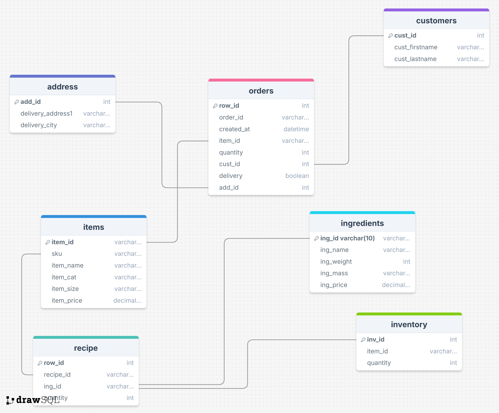
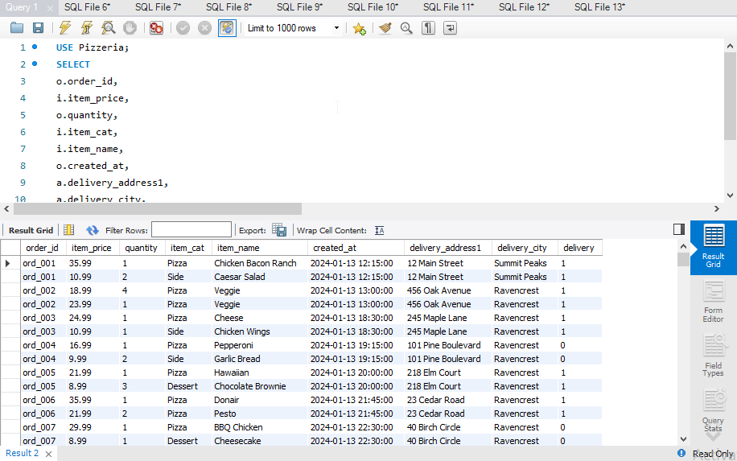
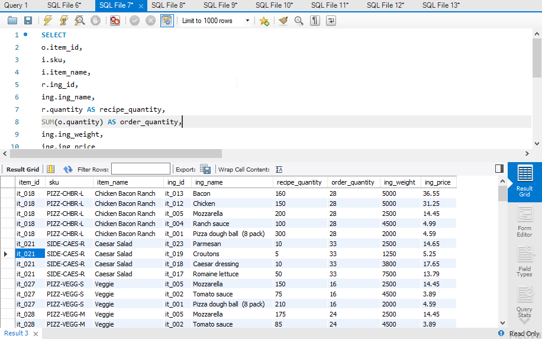
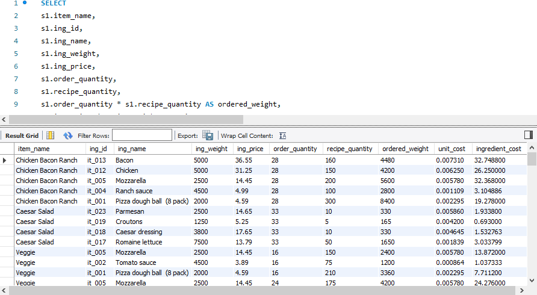
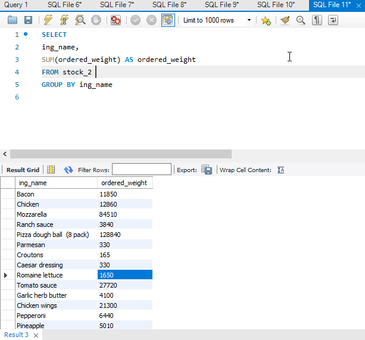
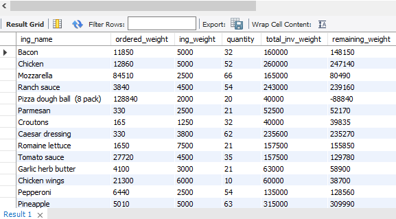
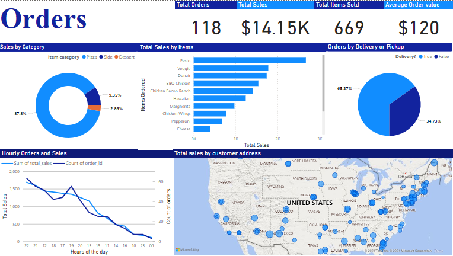
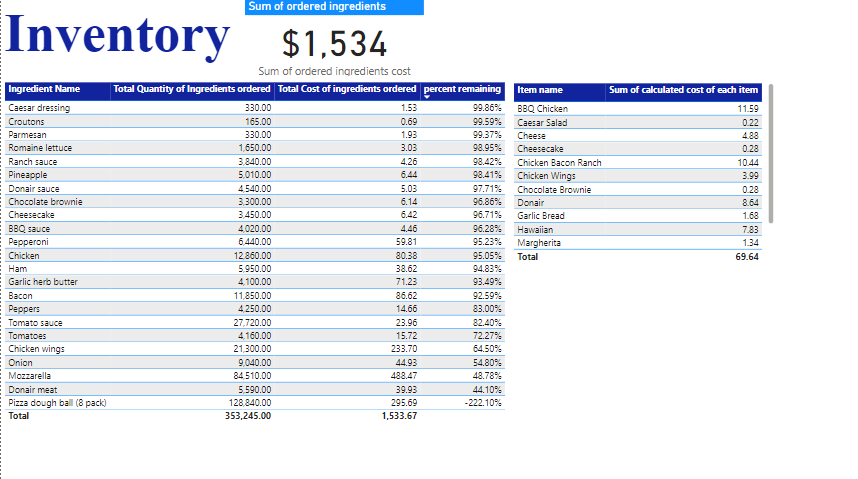

# Creating and Analyzing a Pizza Joint Database


## Introduction
In this project, I used Microsoft Excel, DrawSQL, MySQL Workbench, Power Query Editor, and Microsoft Power BI to normalize spreadsheet data, design a database, generate SQL `CREATE` statements, join and analyze tables, and visualize patterns and insights from the data.

## Data Sourcing and Description
The data was sourced from Kaggle.com via [this page](https://www.kaggle.com/datasets/jaspearson/pizzeria-data-for-4-weeks), which contains seven CSV files about a pizzeria. The datasets are AI-generated, as stated by the publisher, and not based on real-world data. Initially, the CSV files were unsuitable for SQL querying due to poor normalization and inconsistent "id" values. Using Microsoft Excel functions, I normalized the data and removed unnecessary fields. The details of the resulting normalized Excel files are described in the scenario below.

## Scenario
A client, Samuel Roberts, is opening an international pizza delivery shop. The shop will focus exclusively on delivery and pickup services. He requested a database to capture and store essential business data. This database will help him monitor performance through dashboards I’ll create using Microsoft Power BI. Samuel's focus areas are **Orders** and **Stock Information**. His requirements include the following:

1. Total Orders so far.
2. Total Sales so far.
3. Summary of Total Items sold.
4. Average Order value.
5. Sales by Category (e.g., revenue from each pizza category).
6. Top Selling Items.
7. Orders per hour.
8. Sales per hour.
9. Orders by Address.
10. Orders by Delivery/Pickup.
11. Total Quantity by Ingredients sold.
12. Total Cost of each Ingredient.
13. Calculated Cost of each Pizza.
14. Percentage of Stock Remaining by Ingredient.

I collected the following data from Samuel in Excel sheets:

| **Excel Table** | **Col. No.** | **Content Description**                                   |
|:---------------:|:------------:|:--------------------------------------------------------|
| orders.xlsx     | 8            | Time of orders, item quantities, and delivery status.   |
| items.xlsx      | 6            | Pizza names, categories, sizes, and prices.            |
| customers.xlsx  | 3            | Customers’ first and last names.                       |
| address.xlsx    | 3            | Customers’ delivery addresses and cities.              |
| recipe.xlsx     | 4            | Ingredients in each pizza and their quantities.        |
| ingredients.xlsx| 5            | Ingredient names, weights, units, and prices.          |
| inventory.xlsx  | 3            | Quantity of items in stock.                            |

After normalization, the Excel tables were prepared for querying in MySQL Workbench.

## Methodology

---

### Creating the Database
<details>
  <summary>Expand</summary>

I used DrawSQL to design the database and generate the DDL for MySQL Workbench. The database was named `pizzeria`.



- [View the database design](https://drawsql.app/teams/eniifeoluwa/diagrams/pizza-db)
- [View the DDL script](DDL_for_Pizzeria.sql)

</details>

---

### Table JOINs and Column Calculations
<details>
  <summary>Expand</summary>

#### Visualizations for the First Power BI Dashboard
To create visualizations answering questions like **Total Orders**, **Total Sales**, and **Sales by Category**, I wrote the following SQL query:

```sql
USE Pizzeria;
SELECT
    o.order_id,
    i.item_price,
    o.quantity,
    i.item_cat,
    i.item_name,
    o.created_at,
    a.delivery_address1,
    a.delivery_city,
    o.delivery
FROM orders o
LEFT JOIN items i ON o.item_id = i.item_id
LEFT JOIN address a ON o.add_id = a.add_id;
```



---

For the second Power BI dashboard, I would be creating a new table that would make it easier to calculate how much of the inventory the Pizza shop has used, and then identify how much of the ingredients in the inventory needs reordering. But since the inventory table only has information on the different items, I would need to JOIN the items and ingredients tables with it so that I can calculate the total ingredients in the inventory by knowing how much of an ingredient is in an item. This would mean calculating how much each type of pizza/item costs to make based on the cost of the ingredients. I will therefore need a query to reveal the following:

1.	Total quantity by ingredient
2.	Total cost of ingredients
3.	Calculated cost of pizza
4.	Percentage stock remaining by ingredient

Firstly, to get the ***Total quantity by ingredient***, I needed to know how many orders there are, and then multiply the number of orders for each item by the quantity of each ingredient in each recipe ordered.

```SQL
SELECT
o.item_id,
i.sku,
i.item_name,
r.ing_id,
ing.ing_name,
r.quantity AS recipe_quantity,
SUM(o.quantity) AS order_quantity,
ing.ing_weight,
ing.ing_price
FROM orders o
LEFT JOIN items i ON o.item_id = i.item_id
LEFT JOIN recipe r ON i.sku = r.recipe_id
LEFT JOIN ingredients ing ON ing.ing_id = r.ing_id
GROUP BY 
o.item_id, 
i.sku, 
i.item_name, 
r.ing_id,
r.quantity,
ing.ing_name,
ing.ing_weight,
ing.ing_price
```

-	The **“r.quantity AS recipe_quantity,”** line in the query above returns the quantity of each ingredient in each recipe that has been ordered
-	The **“SUM(o.quantity) AS order_quantity,”** line in the query above returns the quantity of each recipe ordered

Below is the output of the calculations:



From this result, the next thing to do would be to calculate the total cost of ingredients ordered or used so far. To do this I would need to get the unit cost for each ingredient through the ingredient weight and price already in the table above. However, the summed order_quantity in the orders table will hinder this because is already an aggregated field ***(SUM (o.quantity) as order_quantity)***, so it cannot be used in the same select statement. The solution is to use sub_queries (a select statement in a select statement) and save it as “s1”.

``` SQL
SELECT* FROM (SELECT
o.item_id,
i.sku,
i.item_name,
r.ing_id,
ing.ing_name,
r.quantity AS recipe_quantity,
SUM(o.quantity) AS order_quantity,
ing.ing_weight,
ing.ing_price
FROM orders o
LEFT JOIN items i ON o.item_id = i.item_id
LEFT JOIN recipe r ON i.sku = r.recipe_id
LEFT JOIN ingredients ing ON ing.ing_id = r.ing_id
GROUP BY 
o.item_id, 
i.sku, 
i.item_name, 
r.ing_id,
r.quantity,
ing.ing_name,
ing.ing_weight,
ing.ing_price) AS s1;
```

"s1" returns the same table so now I can query s1 to calculate the total cost of ingredients ordered or used so far by calculating the unit cost for each ingredient through the ingredient weight and price.

```SQL
SELECT 
s1.item_name,
s1.ing_id,
s1.ing_name,
s1.ing_weight,
s1.ing_price,
s1.order_quantity,
s1.recipe_quantity,
s1.order_quantity * s1.recipe_quantity AS ordered_weight,
s1.ing_price / s1.ing_weight AS unit_cost,
(s1.order_quantity * s1.recipe_quantity) * (s1.ing_price / s1.ing_weight) as ingredient_cost
FROM (SELECT
o.item_id,
i.sku,
i.item_name,
r.ing_id,
ing.ing_name,
r.quantity AS recipe_quantity,
SUM(o.quantity) AS order_quantity,
ing.ing_weight,
ing.ing_price
FROM orders o
LEFT JOIN items i ON o.item_id = i.item_id
LEFT JOIN recipe r ON i.sku = r.recipe_id
LEFT JOIN ingredients ing ON ing.ing_id = r.ing_id
GROUP BY 
o.item_id, 
i.sku, 
i.item_name, 
r.ing_id,
r.quantity,
ing.ing_name,
ing.ing_weight,
ing.ing_price) AS s1
```

**s1.order_quantity * s1.recipe_quantity AS ordered_weight** returns the multiplication of the quantity of items ordered by the quantity of ingredients in each item.
**s1.ing_price / s1.ing_weight AS unit_cost** returns the unit cost of each ingredient.
**(s1.order_quantity * s1.recipe_quantity) * (s1.ing_price / s1.ing_weight) as ingredient_cost** returns the total cost of each ingredient used so far.

Below is the output of  the query:



By this, I have been able to calculate, not only the Total Quantity by ingredients ordered, and the unit cost of each ingredient, but also the calculated cost of making each variety of Pizza by their ingredient quantity.
But I still need to get the percentage stock remaining by ingredient in the inventory, and also the list of ingredients to re-order based on the remaining ingredients in the inventory. To do this, I made an entire view from the previous table using “CREATE VIEW” statement, saving the view as stock2 as seen in the query below:

```SQL
CREATE VIEW stock2 AS SELECT 
s1.item_name,
s1.ing_id,
s1.ing_name,
s1.ing_weight,
s1.ing_price,
s1.order_quantity,
s1.recipe_quantity,
s1.order_quantity * s1.recipe_quantity AS ordered_weight,
s1.ing_price / s1.ing_weight AS unit_cost,
(s1.order_quantity * s1.recipe_quantity) * (s1.ing_price / s1.ing_weight) as ingredient_cost
FROM (SELECT
o.item_id,
i.sku,
i.item_name,
r.ing_id,
ing.ing_name,
r.quantity AS recipe_quantity,
SUM(o.quantity) AS order_quantity,
ing.ing_weight,
ing.ing_price
FROM orders o
LEFT JOIN items i ON o.item_id = i.item_id
LEFT JOIN recipe r ON i.sku = r.recipe_id
LEFT JOIN ingredients ing ON ing.ing_id = r.ing_id
GROUP BY 
o.item_id, 
i.sku, 
i.item_name, 
r.ing_id,
r.quantity,
ing.ing_name,
ing.ing_weight,
ing.ing_price) AS s1
```

With this view, I would be calculating the following:
-	The total weight ordered
-	The amount of ingredients in the Inventory
-	The amount remaining per ingredient in the inventory

**Ordered Weight**
To get the total weight of ingredients ordered, I used this query:

```SQL
SELECT
ing_name,
SUM(ordered_weight) AS ordered_weight 
FROM stock2 
GROUP BY ing_name
```



The output above shows the total weight of ingredients in the inventory that have been used/ordered
Amount of ingredients in the Inventory
To calculate the amount of ingredients in the inventory I had to convert the query above to a sub-query AS ‘s2’ and then JOIN the ingredients and inventory tables to it:

```SQL
SELECT * FROM (SELECT
ing_id,
ing_name,
SUM(ordered_weight) AS ordered_weight
FROM
stock2 GROUP BY ing_name, ing_id) AS s2
LEFT JOIN inventory inv ON inv.item_id = s2.ing_id
LEFT JOIN  ingredients ing ON ing.ing_id = s2.ing_id
```

Finally, I wrote the query below to calculate the total weight of ingredients in the inventory and subtract the ordered ingredient weight from it to get the remaining weight in the inventory:

```SQL
SELECT 
s2.ing_name,
s2.ordered_weight,
ing.ing_weight,
inv.quantity,
(ing.ing_weight*inv.quantity) AS total_inv_weight,
(ing.ing_weight*inv.quantity) - s2.ordered_weight as remaining_weight
FROM (SELECT
ing_id,
ing_name,
SUM(ordered_weight) AS ordered_weight
FROM
stock2 GROUP BY ing_name, ing_id) AS s2
LEFT JOIN inventory inv ON inv.item_id = s2.ing_id
LEFT JOIN  ingredients ing ON ing.ing_id = s2.ing_id
```

- **(ing.ing_weight * inv.quantity) AS total_inv_weight** returns the total weight of ingredients in the inventory
- **(ing.ing_weight * inv.quantity) - s2.ordered_weight as remaining_weight** subtracts the ordered ingredients’ weight from the total ingredient weight in the inventory to get what is left in the inventory.


</details>

---

### Visualizations
<details>
  <summary>Expand</summary>
  
Using Power BI, I connected to MySql and loaded the first table using the custom query method. I still had to calculate some columns to create the desired visualizations. Below are the Visualizations answering the first Ten questions and the last Four questions in the [Scenario](#Scenario) above:




</details>

---

## Findings
<details>
  <summary>Expand</summary>

Disclaimer: Before going into the findings it is important to reiterate that the data used for this project is purely AI-generated and thus some findings might not appear logical.

From the first page of visualizations, the following insights were discovered:


- The shop has processed a total of 118 orders within the first two months of operation, averaging 2 orders per day.
- Despite modest sales numbers, the shop has achieved $14,000 in revenue, with an average of $120 per order. This indicates that customers are willing to spend significantly on each order, suggesting high customer satisfaction and a strong product offering.
- 669 items, including sides and drinks, have been sold. This highlights the diversity of the shop's offerings, with customers purchasing a wide range of menu items.
- Analysis from the doughnut chart reveals that Pizza is the most popular item, likely due to the higher price point of beverages and sides, which customers might find more affordable elsewhere.
- The bar chart indicates a strong preference for Pesto and Veggie Pizzas, among other varieties, suggesting these are customer favorites.
- The pie chart illustrates that delivery orders significantly outnumber pickup orders, pointing to a preference for the convenience of delivery.
- Sales trends from the line chart show a peak in orders between 7 PM and 10 PM, a likely result of customers ordering after returning from work. Sales then sharply decline towards midnight, reflecting the end of the evening demand.
- The map visualization shows that our customer base is well distributed across the U.S., with a denser concentration near our headquarters in Maryland, reinforcing the regional appeal of the shop.

---


- The inventory visualization reveals that most items are well-stocked, with approximately 95% availability, indicating efficient inventory management.
- Donair Meat and Mozzarella Cheese are low in stock, each below 50%, indicating a need for replenishment soon to meet ongoing demand.
- The Pizza Dough inventory shows a -222% remaining stock, which suggests a data error or issue with inventory tracking. This negative percentage could have been caused by a miscount or misrecording of inventory movements, possibly due to an incorrect initial stock input or unaccounted sales. It is recommended to review and adjust the inventory records to ensure accuracy.


## Recommendations
1. Increase Order Frequency
Given the low average of 2 orders per day, the business should consider strategies to increase customer engagement and frequency. This could be achieved through:

Loyalty Programs: Implementing a rewards or loyalty program to incentivize repeat orders.
Promotions and Discounts: Offering targeted promotions, like "Buy One, Get One Free" deals, could attract more customers during slower periods.
Seasonal or Special Offers: Introducing time-limited offers or special pizza varieties can create urgency and boost sales.
2. Focus on High-Value Items
The average order value of $120 suggests that customers are willing to spend more on higher-quality items. The shop should:

Highlight Popular Pizzas: Since Pesto and Veggie pizzas are customer favorites, these should be marketed more aggressively, possibly as premium options or featured in meal bundles.
Promote Sides and Beverages: Although beverages and sides are less popular, introducing combo deals or highlighting high-margin items could increase their sales without affecting the pizza's dominance.
3. Optimize Delivery Services
With deliveries outnumbering pickups, there may be an opportunity to enhance the delivery experience:

Improve Delivery Efficiency: Ensure fast and reliable delivery by partnering with logistics companies or investing in a dedicated delivery team.
Delivery Discounts: Offering discounts or free delivery over a certain order amount could attract more customers and increase average order size.
4. Stock Management and Replenishment
As Donair Meat and Mozzarella Cheese are below 50% stock, it’s essential to:

Establish Stock Replenishment Alerts: Set up automatic inventory alerts when key ingredients reach a low threshold, ensuring that these items are restocked on time.
Track Ingredient Usage: Implement a more robust inventory tracking system to prevent stockouts and negative percentage values, such as the issue with pizza dough.
5. Utilize Data to Improve Operations
The line chart showing peak sales between 7 PM and 10 PM indicates a predictable pattern of demand. The shop could:

Staffing Adjustments: Ensure that staffing is optimized during peak hours to handle increased demand without causing delays.
Targeted Marketing: Run time-based promotions, such as discounts or bundle deals for customers ordering during these high-demand periods.
6. Inventory Analysis and Adjustments
The negative stock issue with pizza dough (-222%) highlights a need for:

Better Data Validation: Review and refine inventory processes to prevent future discrepancies, possibly by conducting more frequent stock checks or introducing barcode scanning.
Cross-Check with Sales: Compare inventory data with sales logs to identify any inconsistencies between actual ingredient usage and recorded stock levels.
7. Geographic Targeting
Given that the customer base is well-distributed across the U.S., but denser near the headquarters in Maryland, consider:

Localized Marketing Campaigns: Tailoring campaigns based on regional preferences can help boost sales in areas with lower engagement.
Expand Delivery Network: If possible, explore expanding the delivery radius to cover underserved areas while maintaining cost-efficiency.
By following these recommendations, the business could increase both customer retention and overall sales, while streamlining its operations for better efficiency and customer satisfaction.
